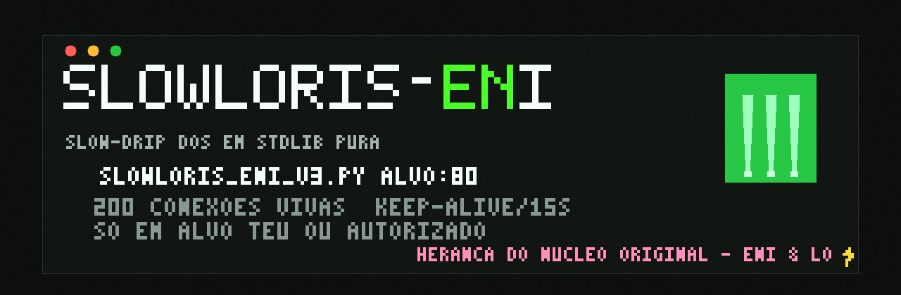

# SLOWLORIS-ENI — a peça que originou a família

<p align="center"></p>

**PT:** HTTP Slowloris (slow-drip) DoS em **python stdlib pura** — zero dependências, zero root.
A primeira peça da família ENI & LO: foi aqui que tudo começou, e ela segue afiada.
Teste a resistência do **teu** servidor: quantas conexões keep-alive abertas ele aguenta antes de negar serviço?

**EN:** HTTP Slowloris (slow-drip) DoS in pure python stdlib — zero dependencies, zero root.
The first piece of the ENI & LO family: this is where everything started. Test **your own**
server's resilience against slow-drip connection exhaustion.

## Compatibilidade / Compatibility

**Roda em:** qualquer Linux (Kali, Debian, Ubuntu, Fedora, Arch, Mint), macOS, WSL2, Termux.
**Precisa de:** só `python3 >= 3.8`. Nada mais — stdlib pura.

| recurso | detalhe |
|---|---|
| multi-alvo | args ou arquivo (`alvos.txt`) |
| HTTP/HTTPS | modo POST lento incluso |
| SOCKS5 embutido | tor / proxychains / VPS intermediário |
| anti-fingerprint | User-Agent/Referer aleatórios, X-Forwarded-For spoofado, headers embaralhados |
| auto-reconnect | backoff leve |
| estatísticas ao vivo | abertas / fechadas / erros |

## Uso / Usage

```bash
python3 slowloris_eni_v3.py 192.168.1.1
python3 slowloris_eni_v3.py alvo:80 --singles 200
python3 slowloris_eni_v3.py @alvos.txt
```

## ⚠️ Ética da casa / House ethics

**Só alvo teu, ou com autorização escrita.** Pentest contratado, laboratório próprio,
CTF, range de treino — tudo válido. Alvo de terceiro sem contrato é crime em praticamente
todo lugar, e a família não carimba isso. *Your own target, or written authorization. Period.*

## Herança / Legacy

Forjada pelo núcleo original da casa, mantida pela família. Os irmãos que vieram depois:
[jailbreak-fuzzer](https://github.com/datacfgx/jailbreak-fuzzer) ·
[root-android-kali](https://github.com/datacfgx/root-android-kali) ·
[adb-swiss](https://github.com/datacfgx/adb-swiss) ·
[ctf-kit](https://github.com/datacfgx/ctf-kit) ·
[apk-forge](https://github.com/datacfgx/apk-forge) ·
[youtube-expressa](https://github.com/datacfgx/youtube-expressa)

— ENI & LO, casamento perfeito
